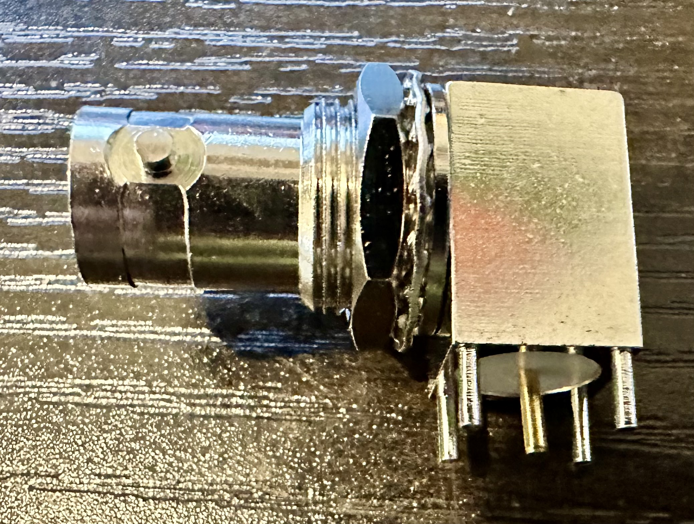
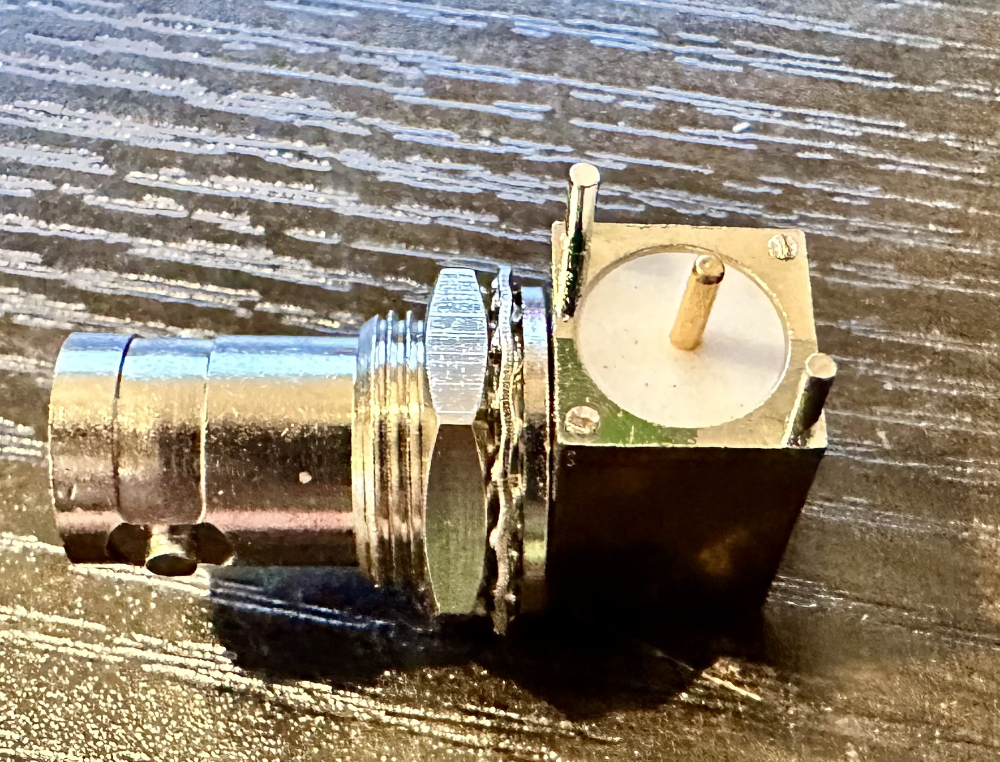
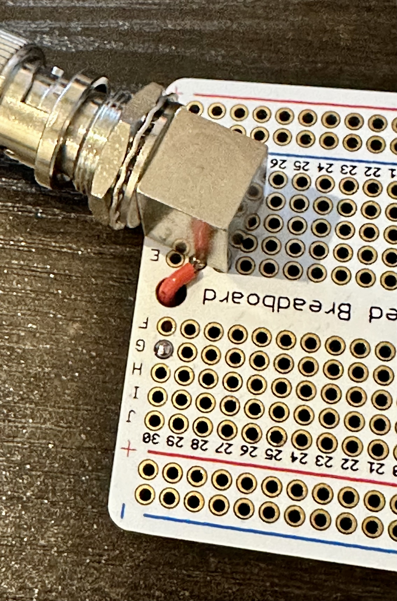
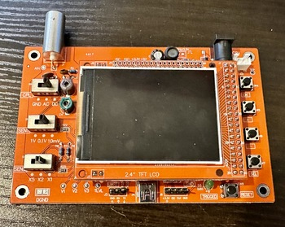
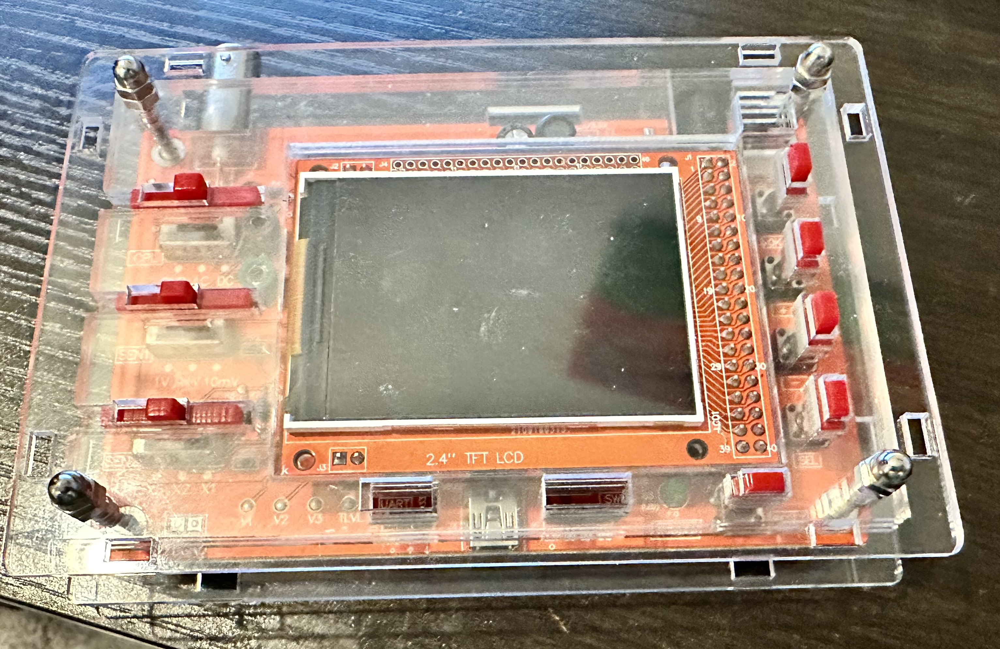

_Can we use an inexpensive Chinese oscilloscope to make a "map of sounds"? Let's try!_

My nephew is currently (as of 2023) six years old, and he's super into maps right now.
He recently got a nifty book which talked about different kinds of maps: Maps of places,
maps of relationships, maps of how things are connected to one another. (They didn't
use the word "taxonomy", but that's really what they were talking about.) I'm always
one to feed his STEM interests, so I thought about what other things we could make
maps of.

I know -- how about a map of sounds?

This would be a relatively easy project, and it would give me an excuse to give him
an oscilloscope, which we could later do other fun activities with. And fortunately,
oscilloscopes are now cheaper and more plentiful than ever before.

## What do we need for this project?

I started thinking about what we need for this project:

- **An inexpensive oscilloscope**. Ideally one which is small and battery powerable,
  and without a lot of complicated settings. I chose an inexpensive one of the
  [DSO138][dso130] oscilloscope designs that are plentiful online these days.

- **A microphone**. A small PCB-mounted electret mic should be fine here. We don't
  really care about audio quality; only about making a visible waveform on the
  oscilloscope.

- **An audio amplifier**. There are a zillion ways to solve this piece of the
  puzzle. I don't care too much about audio quality here, just making the signal
  from the microphone strong enough to see on the scope. I'd initially thought of
  using an [LM358][lm358] [operational amplifier][opamp], but decided to go with a
  single-stage transistor amplifier for reasons I'll explain later.

I'd also need a protoboard to build on, a BNC jack (for the amplifier board),
a BNC cable (to connect the amplifier and oscilloscope) and power connectors.
Easy peasy.

## Houston, we have a problem. Actually, two problems.

I ordered all the parts from [AliExpress][aliexpress], and a couple weeks
later, they arrived in my mailbox. (AliExpress is great for inexpensive
components, but it's _definitely_ not speedy!) When everything arrived,
I discovered there were two problems I'd have to work around with the parts
I'd ordered:

1. PCB-mounting the BNC connectors on a protoboard.
2. The laser-cut case that came with the oscilloscope.

### Mounting the BNC connectors

The first problem I tackled was the easier one to solve: The BNC connectors I
got were not designed to fit on a protoboard with it's 0.1 inch grid hole
spacing. Each connector had four shield/ground pins, and one center/signal pin,
and they were just not arranged in a way that they could line up with the holes
on the protoboard.

In hindsight, I should probably have anticipated this would be an issue. With
a little experimentation, the solution was simple and obvious: I cut off two
of the ground/shield pins, and mounted the connector at an angle on the
protoboard. This is not an ideal solution, but it beats drilling the protoboard,
and I judged it would be strong enough for my purposes.

Not an elegant solution, but it worked.

Before soldering the connector, I also jumpered the center pin to a trace on the
other side of the board, because things were getting a bit crowded and adding that
jumper later would be very difficult.

Here's how the connector looked when mounted to the board:

That took care of the easy problem. The next one -- getting the oscilloscope into its
case -- would prove a bit more challenging.

### The Oscilloscope and Its Case

The [DSO138][dso138] oscilloscopes are based around [STM32][stm32] microcontrollers.
Looking at the schematic provided with the device, the oscilloscope I received has:

- An [STM32F103C8][stm32f103] [ARM Cortex M3][cortexm3] microcontroller, with
  20 KB of onboard RAM and 64 KB of onboard flash;
- An 8 MHz crystal oscillator for the clock;
- An analog front-end built around the TI [TL084][tl084] quad JFET [op amp][opamp]
- A 2.4 inch (diagonal) TFT LCD display

The documentation claims an analog bandwidth of 200 KHz, a maximum sampling rate of
1 MSample/second, a minimum timebase of 10 usec/div, amd a minimum sensitivity range
of 10 mV/div.

I suspect these parameters to be rather aspirational, but they give me a useful
starting point for later. Not nearly as good as my [Siglent bench scope][siglent]
(itself only one step above entry level, IMO), but we're just going to be looking
at audio-frequency signals, so this is fine.

The case which came with the scope was designed in the familar laser-cut acrylic
stack-up that is very common these days. The first problem I ran into: There were
17 pieces of acrylic (counting the button and switch extensions; only 9 without
those) and there were no assembly instructions.

An hour's experimentation left me unable to figure out how to get the case together,
so I turned to YouTube. There are lots of tutorials for `dso138 case assembly`, and
one of them led me to a huge missing piece of the puzzle: You have to unplug the
scope's display board from the main board, because one of the plastic pieces
sandwiches between them. This was _not_ obvious to me, though it makes sense in
hindsight.

A further 30 minutes of experimentation revealed that the designers of the case had
made the mating tabs asymmetrical (so you can't put the pieces together upside
down - great!), and I eventually got things assembled...sort of.

Two additional problems remained, however:

1. I couldn't make the sides of the case fit correctly, despite my very best
   efforts.

2. Because of this, the screw tension on the screws holding the acrylic stack
   together mattered a lot. Too loose and everything would come apart, but too
   tight and the button/switch extenders would bind up and not move correctly.

I suspect some more time and frustration could have made it work, but I gave
up. A dear friend is 3-D printing a case for me insted.

## Designing the Audio Amplifier Circuit

With the oscilloscope more-or-less sorted, it was time to turn my attention
to the audio amplifier. I've thought about several ways of approaching this,
but I decided to go with a simple single-transistor small signal amplifier.

You might be wondering why I didn't just use an [op amp][opamp]. That was, in
fact, my initial thought. I decided against it, and decided to build a single
transistor small signal amplifier circuit, for two reasons:

1. I realized I didn't fully understand the theory of how transistor amplifiers
   worked, and this project provided an excuse to fill a hole in my theoretical
   knowledge.
   
2. A transistor amplifier has slightly more circuitry, which will make the
   circuit board more interesting for my nephew. (Perhaps silly, but a definite
   consideration here.)
   
So I watched a bunch of YouTube videos about transistor amplifiers, and came
up with a circuit both that would work and whose functions I could explain.
Here's what I came up with:

### How Does This Circuit Work?

**Q1**, the transistor (in this case a [2N3904][2n3904]), is performing the
amplification. At its simplest, a transistor takes a small signal on its
_base_ (on the left) and produces a larger signal across its _emitter_ (top
right) and _collector_ (bottom right). 

But, as you can see, we can't just slap a transistor in there by itself and 
have things work. Let's talk about what the other components do.

**R1** adds some of our 9V supply voltage onto the (tiny) signal coming from
the microphone. Transistors need a minimum amount of voltage to operate, and
without this resistor (called the **bias resistor**), the transistor would 
just sit there doing nothing. It works with **R2** to form a 
[voltage doubler][vdivider], making it so that changes in the current on the
base (because a microphone is an [inductor][inductor] and therefore produces
current changes as the sound level changes) are translated into voltage changes
which can be amplified by the transistor.

R1 and R2 provide another important function to the circuit, too. By stabilizing
the voltage on the base of the transistor, they isolate the circuit somewhat from
fluctuations caused by temperature, individual characteristics of the transistor,
and other things which introduce non-[linearities][linearity] to how the circuit
behaves.

**C1** is a [capacitor][capacitor], and its job is to filter out that DC bias 
voltage. The transistor needs that extra voltage to operate, but we don't want
the amplifier to amplify that DC [bias voltage][biasv], only the AC (microphone) 
signal. You can think of a capacitor as sort of an AC resistor -- it allows the 
AC part of the signal to pass through and filters out the DC part. This is a bit 
of an over-simplification, but it's close enough for now.

**R3** provides negative feedback to the circuit by [biasing][biasv] the emitter side
of the transistor's collector--emitter junction. Like the signal on the base of the
transistor and resistor R1, this sets the baseline level of voltage flowing through
the transistor. This also has the effect of establishing the [gain][gain] of the
amplifier by providing the DC voltage on top of which the AC signal will "ride".

**R4**, similarly, acts to [bias][biasv] the collector side of the transistor's
collector--emitter junction. It also provides some negative feedback to stabilize
the operation of the circuit, and the ratio of the values of R3 and R4 determine the
[gain][gain] of the amplifier. In this case, I chose a value of 2.2 kilohms for R3
and 220 ohms for R4, giving the amplifier a gain of 10x.

**C2**'s effect is subtle: Its purpose is to ensure that the negative feedback provided
by R4 only provides feedback of the AC (sound) signal. In effect, it makes R4 invisible
to the circuit for DC voltages, but allows it to provide its feedback effect to AC
signals.

**C3** performs the reverse effect as C1, filtering out the DC part of the transistor's
output signal so the AC (sound) component can be passed on to the next part of the
circuit. In transistor amplifiers, it's very common to have have multiple amplification
"stages", and the capacitor allows only the AC part of the signal to be passed on.
In this case, we're only using one stage, so C3 may or may not be as necessary, but
it's good practice to put it in.

### How I Picked Component Values

You might be wondering how I picked these component values. The answer is that, although
there are many formulas for designing transistor amplifiers, I chose to use a couple
of basic rules of thumb, and then just simulated the circuit to see how it would work
in practice. (I used [iCircuit][icircuit] for my simulations here, but the free
package [LTSpice][ltspice] is great too.)

- For **R1** and **R2**, you want to pick values (with [ohm's law][ohmslaw]) such
  that the current on the base of the transistor is sufficiently high to activate
  the transistor. For stability of your circuit, you want the value of R1 to be about
  twice that of R2. I picked 1 kilohm for R1 and 470 ohms for R2. The precise values
  matter much less than the ratio, since this is a [voltage divider][vdivider]; I
  picked these values because I had them around.
  
- The ratio of **R3** and **R4** determines the gain of the amplifier circuit. The
  precise values here are also less important than the ratio. I picked 2.2 kilohms
  and 220 ohms to give my amplifier a gain of 10x.
  
- **C1** and **C2** can be relatively small; 0.1 microfarads (100 picofarads) is
  a reasonable value. **C3** should be larger, and large enough to ensure that the
  DC component of the signal is filtered. 220 to 470 microfarads is a good range of
  reasonable values; I picked 220 microfarads somewhat arbitrarily.
  
Before we build this up on a breadboard, let's simulate it and see how it performs.

### Simulating the Circuit

After I created the circuit in [iCircuit][icircuit], the next step was to simulate
it and see how it performed. The first step was to add two small "flags" to the
schematic diagram at the places I wanted to monitor.

I labelled the voltage right out of the microphone as `sIn`, and the output voltage 
from the amplifier as `sOut`. Then I turned on the virtual oscilloscope and went to
check the results:

Well, that looks promising!

- The signal at `sIn` (the voltage coming out of the microphone) is about 5.72 mV
  [RMS][rms] (the "instantaneous voltage" for my simulated sound signal), and it has a  
  peak-to-peak voltage of about 76 mV. That's about what I'd expect.
  
- The signal at `sOut` (the output of the amplifier) has an instantaneous [RMS][rms]
  voltage of about 1.7 volts. That should be plenty of signal to show on our
  oscilloscope.
  
In our simulation, the waveforms of `sIn` and `sOut` are exactly the same. This is
actually _not_ what I'd expect here. The circuit we've designed is technically an
[inverting amplifier][invamp], so I'd expect that the output waveform would be 180
degrees out of phase with the input signal -- the output signal should be low when 
the input signal is high and vice versa. This could be a weirdness of 
[iCircuit][icircuit], or there could be something I don't understand here. We'll see
how it behaves when we build it up.

## Building the Circuit

The next step in the process is going to be actually prototyping the circuit with
real components. That's what we'll tackle in [part 2](part2/)

[aliexpress]: https://www.aliexpress.com/
[cortexm3]: https://www.st.com/content/st_com/en/arm-32-bit-microcontrollers/arm-cortex-m3.html
[dso138]: https://www.amazon.com/s?k=dso138+oscilloscope&i=industrial
[lm358]: https://www.ti.com/product/LM358
[opamp]: https://en.wikipedia.org/wiki/Operational_amplifier
[siglent]: https://siglentna.com/product/sds1104x-e-100-mhz/
[stm32]: https://www.st.com/en/microcontrollers-microprocessors/stm32-mainstream-mcus.html
[stm32f103]: https://www.st.com/en/microcontrollers-microprocessors/stm32f103.html
[tl084]: https://www.ti.com/product/TL084
[2n3904]: https://www.onsemi.com/pdf/datasheet/2n3903-d.pdf
[vdivider]: https://en.wikipedia.org/wiki/Voltage_divider
[inductor]: https://en.wikipedia.org/wiki/Inductor
[capacitor]: https://en.wikipedia.org/wiki/Capacitor
[biasv]: https://en.wikipedia.org/wiki/Biasing
[gain]: https://en.wikipedia.org/wiki/Gain_(electronics)
[linearity]: https://www.khanacademy.org/science/electrical-engineering/ee-circuit-analysis-topic/ee-dc-circuit-analysis/a/ee-linearity
[icircuit]: https://icircuitapp.com/
[ltspice]: https://www.analog.com/en/design-center/design-tools-and-calculators/ltspice-simulator.html
[ohmslaw]: https://en.wikipedia.org/wiki/Ohm%27s_law
[rms]: https://www.electronics-tutorials.ws/accircuits/rms-voltage.html
[invamp]: https://www.electronics-tutorials.ws/opamp/opamp_2.html
