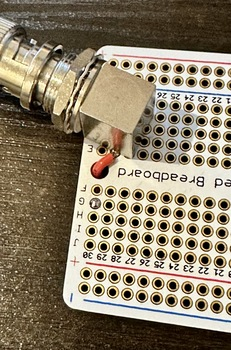
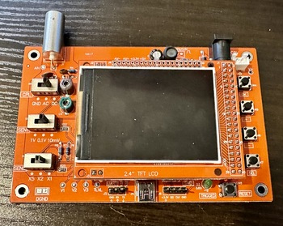

_Can we use an inexpensive Chinese oscilloscope to make a "map of sounds"? Let's try!_

My nephew is currently (as of 2023) six years old, and he's super into maps right now.
He recently got a nifty book which talked about different kinds of maps: Maps of places,
maps of relationships, maps of how things are connected to one another. (They didn't
use the word "taxonomy", but that's really what they were talking about.) I'm always
one to feed his STEM interests, so I thought about what other things we could make
maps of.

I know -- how about a map of sounds?

This would be a relatively easy project, and it would give me an excuse to give him
an oscilloscope, which we could later do other fun activities with. And fortunately,
oscilloscopes are now cheaper and more plentiful than ever before.

## What do we need for this project?

I started thinking about what we need for this project:

- **An inexpensive oscilloscope**. Ideally one which is small and battery powerable,
  and without a lot of complicated settings. I chose an inexpensive one of the
  [DSO138][dso130] oscilloscope designs that are plentiful online these days.

- **A microphone**. A small PCB-mounted electret mic should be fine here. We don't
  really care about audio quality; only about making a visible waveform on the
  oscilloscope.

- **An audio amplifier**. There are a zillion ways to solve this piece of the
  puzzle. I don't care too much about audio quality here, just making the signal
  from the microphone strong enough to see on the scope. I decided that a simple
  audio amplifier circuit based around an [LM358][lm358] [operational amplifier][opamp]
  IC would suffice.

I'd also need a protoboard to build on, a BNC jack (for the amplifier board),
a BNC cable (to connect the amplifier and oscilloscope) and power connectors.
Easy peasy.

## Houston, we have a problem. Actually, two problems.

I ordered all the parts from [AliExpress][aliexpress], and a couple weeks
later, they arrived in my mailbox. (AliExpress is great for inexpensive
components, but it's _definitely_ not speedy!) When everything arrived,
I discovered there were two problems I'd have to work around with the parts
I'd ordered:

1. PCB-mounting the BNC connectors on a protoboard.
2. The laser-cut case that came with the oscilloscope.

### Mounting the BNC connectors

The first problem I tackled was the easier one to solve: The BNC connectors I
got were not designed to fit on a protoboard with it's 0.1 inch grid hole
spacing. Each connector had four shield/ground pins, and one center/signal pin,
and they were just not arranged in a way that they could line up with the holes
on the protoboard.

In hindsight, I should probably have anticipated this would be an issue. With
a little experimentation, the solution was simple and obvious: I cut off two
of the ground/shield pins, and mounted the connector at an angle on the
protoboard. This is not an ideal solution, but it beats drilling the protoboard,
and I judged it would be strong enough for my purposes.

Not an elegant solution, but it worked.

Before soldering the connector, I also jumpered the center pin to a trace on the
other side of the board, because things were getting a bit crowded and adding that
jumper later would be very difficult.

Here's how the connector looked when mounted to the board:

That took care of the easy problem. The next one -- getting the oscilloscope into its
case -- would prove a bit more challenging.

### The Oscilloscope and Its Case

The [DSO138][dso138] oscilloscopes are based around [STM32][stm32] microcontrollers.
Looking at the schematic provided with the device, the oscilloscope I received has:

- An [STM32F103C8][stm32f103] [ARM Cortex M3][cortexm3] microcontroller, with
  20 KB of onboard RAM and 64 KB of onboard flash;
- An 8 MHz crystal oscillator for the clock;
- An analog front-end built around the TI [TL084][tl084] quad JFET [op amp][opamp]
- A 2.4 inch (diagonal) TFT LCD display

The documentation claims an analog bandwidth of 200 KHz, a maximum sampling rate of
1 MSample/second, a minimum timebase of 10 usec/div, amd a minimum sensitivity range
of 10 mV/div.

I suspect these parameters to be rather aspirational, but they give me a useful
starting point for later. Not nearly as good as my [Siglent bench scope][siglent]
(itself only one step above entry level, IMO), but we're just going to be looking
at audio-frequency signals, so this is fine.

The case which came with the scope was designed in the familar laser-cut acrylic
stack-up that is very common these days. The first problem I ran into: There were
17 pieces of acrylic (counting the button and switch extensions; only 9 without
those) and there were no assembly instructions.

An hour's experimentation left me unable to figure out how to get the case together,
so I turned to YouTube. There are lots of tutorials for `dso138 case assembly`, and
one of them led me to a huge missing piece of the puzzle: You have to unplug the
scope's display board from the main board, because one of the plastic pieces
sandwiches between them. This was _not_ obvious to me, though it makes sense in
hindsight.

A further 30 minutes of experimentation revealed that the designers of the case had
made the mating tabs asymmetrical (so you can't put the pieces together upside
down - great!), and I eventually got things assembled...sort of.

Two additional problems remained, however:

1. I couldn't make the sides of the case fit correctly, despite my very best
   efforts.

2. Because of this, the screw tension on the screws holding the acrylic stack
   together mattered a lot. Too loose and everything would come apart, but too
   tight and the button/switch extenders would bind up and not move correctly.

I suspect some more time and frustration could have made it work, but I gave
up. A dear friend is 3-D printing a case for me insted.

## Designing the Audio Amplifier Circuit

With the oscilloscope more-or-less sorted, it was time to turn my attention
to the audio amplifier. I'll be updating this page as I make progress on
that, so check back soon for the rest of the project!

[aliexpress]: https://www.aliexpress.com/
[cortexm3]: https://www.st.com/content/st_com/en/arm-32-bit-microcontrollers/arm-cortex-m3.html
[dso138]: https://www.amazon.com/s?k=dso138+oscilloscope&i=industrial
[lm358]: https://www.ti.com/product/LM358
[opamp]: https://en.wikipedia.org/wiki/Operational_amplifier
[siglent]: https://siglentna.com/product/sds1104x-e-100-mhz/
[stm32]: https://www.st.com/en/microcontrollers-microprocessors/stm32-mainstream-mcus.html
[stm32f103]: https://www.st.com/en/microcontrollers-microprocessors/stm32f103.html
[tl084]: https://www.ti.com/product/TL084

